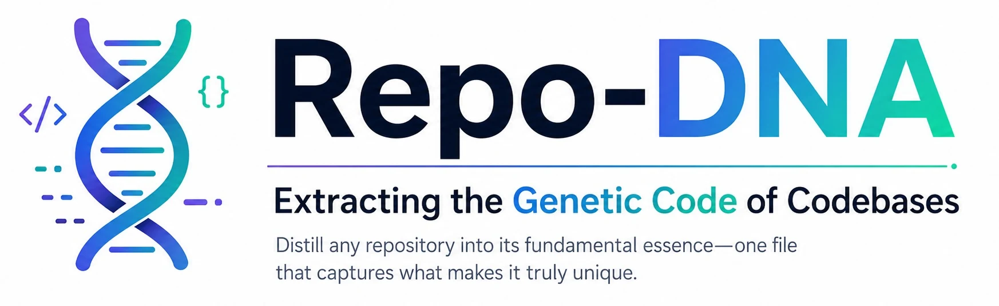

<p align="center">
  
</p>

# Repo-DNA

Every repository exists because it offers something unique. Like DNA in biology—where each organism has a distinct genetic signature—every codebase has core patterns, design decisions, and architectural choices that define its identity. **Repo-DNA** captures this essence.

## What is Repo-DNA?

Repo-DNA is a methodology for distilling complex codebases into their fundamental essence—a single, working file that captures what makes a repository truly unique.

### What Repo-DNA is NOT:

- ❌ A code dump or concatenation for LLM context
- ❌ Documentation or explanation
- ❌ A tutorial or guide
- ❌ Generic patterns shared across many repos

### What Repo-DNA IS:

- ✅ The unique fingerprint of a specific codebase
- ✅ The "why this exists" and "what makes this different" in code form
- ✅ Core architectural decisions expressed as minimal, representative code
- ✅ The mental model a senior developer would carry after deeply understanding the codebase
- ✅ Eventually executable: someone could use this as a seed to rebuild the essence

## How It Works

The DNA is the **delta**: you can't name what's unique about a repo until you've
stated what's *common* for its kind. So extraction works in two moves—establish the
baseline, then capture only what departs from it:

1. **Reference genome**: the competent-default implementation any engineer would
   write for a repo of this archetype. The baseline you diff against.
2. **The load-bearing bet**: the ONE decision that, reversed, would make this a
   different project. Stated in a line, then shown in a small **runnable kernel**.
3. **Signature patterns**: the 2-3 recurring idioms that would surprise someone who
   only knows the baseline.
4. **Structural commitments**: the architectural bets the rest follows from—covering
   *both ends* of the system (how it builds state and how it's consumed/queried).
5. **Growth seams**: the actual surface where the codebase expects to be extended.
6. **Negative-space check**: what was deliberately left out as "common, not DNA,"
   plus a *confusion test*—with names stripped, could this only be THIS repo?

## Format

Each Repo-DNA file is a single file named `<repo>.dna.<ext>` in the repo's primary
language (e.g., `react.dna.js`, `cognee.dna.py`):

- **Density over volume**: target well under 400 lines; if you're near the cap,
  you're including baseline scaffolding, not DNA.
- **One runnable kernel**: a small, self-contained demo of the load-bearing bet
  (standard library only—no heavy deps) that actually executes and prints output.
- **Sketches for everything else**: representative code that carries each idiom
  faithfully but is explicitly allowed to be non-runnable—a portrait, not a clone.
- **One declarative line per element** naming the WHY/the bet; no teaching prose.

## Examples in This Repository

The repo ships a gallery of extracted DNA files. The cleanest, **current-format**
ones—reference-genome framing plus a *verified runnable kernel*—are:

- [`cognee.dna.py`](./cognee.dna.py) — model memory as Pydantic DataPoints; the graph
  is *reflected* off them into a graph + vector + relational tri-store.
- [`react.dna.js`](./react.dna.js) — reconciliation as an *interruptible* fiber walk
  scheduled by priority; render pauses and restarts, commit is synchronous.
- [`OpenMontage.dna.py`](./OpenMontage.dna.py) — no orchestrator process; your coding
  *agent* is the runtime over a declarative pipeline "cartridge."

The rest (`cpython.dna.py`, `graphiti.dna.py`, `linux.dna.c`, `vite.dna.js`,
`supabase.dna.ts`, and more) are earlier extractions in mixed/older formats—useful to
browse, but the three above are the reference shape. The `react-*.js` files predate
the `.dna.*` format entirely and are kept as historical artifacts.

## Generate Your Own Repo-DNA

### Option 1 — Claude Code skill (recommended)

This repo ships the full extraction skill, installable two ways. Once installed,
ask in plain language — it clones the target repo, reads the source, runs a verified
kernel, and writes the `.dna` file.

**A. As a plugin** — one-line marketplace install, versioned updates. Plugin skills
are always namespaced, so it's invoked as `/repo-dna:repo-dna`:

```text
/plugin marketplace add prabhic/repo-dna
/plugin install repo-dna@repo-dna
/repo-dna:repo-dna extract facebook/react
```

**B. As a standalone skill** — copy it into your personal skills directory for a
bare `/repo-dna` (no namespace) in every project:

```bash
git clone https://github.com/prabhic/repo-dna
mkdir -p ~/.claude/skills/repo-dna
cp repo-dna/SKILL.md repo-dna/example.dna.py ~/.claude/skills/repo-dna/
# then, in any project:   /repo-dna extract facebook/react
```

The only difference is the invocation name: plugins are always `/<plugin>:<skill>`;
the bare `/repo-dna` comes from the standalone install. Pick whichever you prefer.

👉 **[Full install guide → INSTALL.md](./INSTALL.md)**

### Option 2 — Raw prompt (other AI systems)

Prefer to drive it manually or use a different AI system? The authoritative
methodology lives in **[SKILL.md](./SKILL.md)**—paste it as a system prompt.
**[REPO_DNA_PROMPT.md](./REPO_DNA_PROMPT.md)** is the original early prompt, kept as
historical context (it predates the current SKILL.md methodology).

### Quick Example:

```
Extract the Repo-DNA for: facebook/react
Extract the Repo-DNA for: vuejs/vue
Extract the Repo-DNA for: expressjs/express
```

## Goal

To provide an agentic framework that generates a single, graspable file for any GitHub repository—capturing the core unique value that makes the repo notable. These files should be:

- **Educational**: Help developers understand "what makes this special"
- **Verified**: One self-contained kernel that actually runs and prints output
- **Essential**: Strip away everything except what departs from the baseline
- **Faithful**: Carry the repo's real idioms in the sketches—without re-implementing it

## Use Cases

- 🎓 **Learning**: Quickly grasp what makes a framework unique
- 🔍 **Evaluation**: Compare architectural approaches across frameworks
- 🤖 **AI Context**: Provide focused context to AI coding assistants
- 📚 **Documentation**: Living code examples of core patterns
- 🚀 **Prototyping**: Use as seeds for building similar systems

## Contributing

Have a Repo-DNA extraction to share? PRs welcome! Make sure your DNA file:
- Captures what's UNIQUE, not what's COMMON (state the reference genome first)
- Stays well under 400 lines — density over volume
- Includes one self-contained kernel that actually runs and prints output
- Has the standard header block and passes the confusion test
- Gives that "aha, now I get it" moment

---

*"This is not the repo. This is what makes the repo unique."* 
